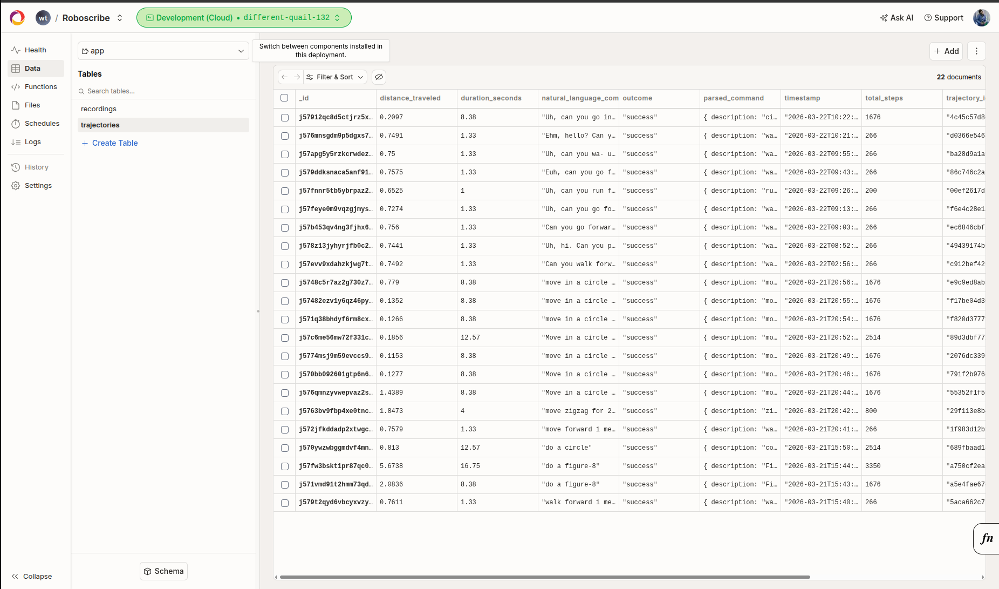
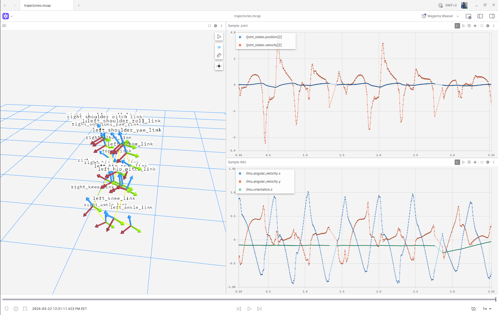
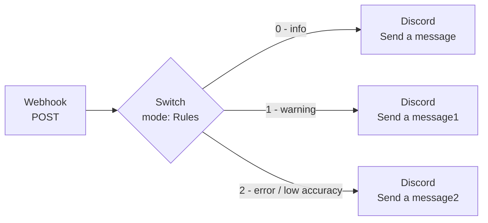
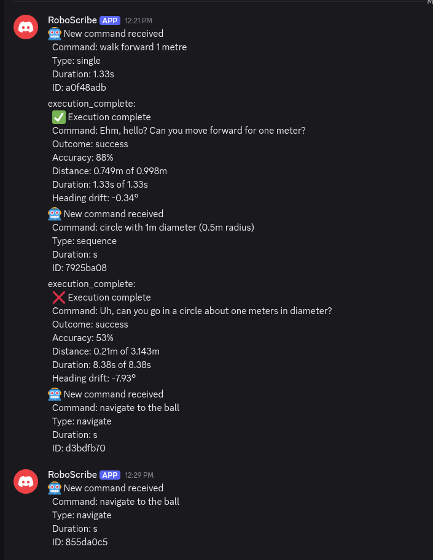
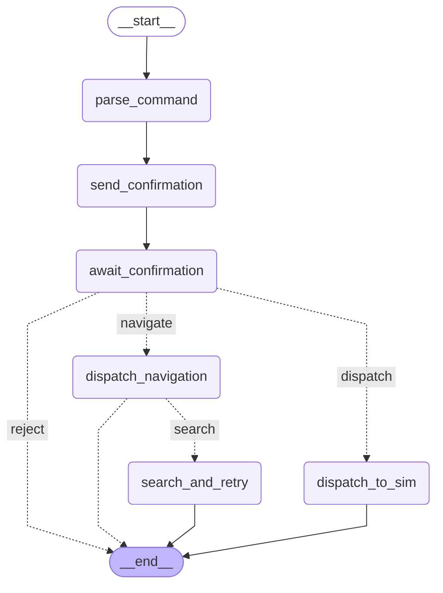

# RoboScribe

**RoboScribe** is a natural language robotics interface that translates plain English commands into humanoid robot motion inside NVIDIA Isaac Sim. You type "walk in a circle of radius 1 meter" — the system parses it, reads it back to you for voice confirmation, executes the motion on a Unitree H1 humanoid, and captures the full joint trajectory at 200Hz for dataset export. It also supports visual navigation: say "go to the desk" and an onboard VLM (Qwen3-VL-2B) locates the object from the robot's camera and steers toward it.

---

## System Overview

Three independent processes communicate over WebSocket, with a FastAPI backend acting as the central hub:

```
┌─────────────────────────────────────────────────────────────────────┐
│                         RoboScribe System                           │
│                                                                     │
│  ┌──────────────┐    WS /ws    ┌──────────────┐    WS /sim         │
│  │  Next.js     │◄────────────►│  FastAPI     │◄──────────────►    │
│  │  Dashboard   │              │  Backend     │   Isaac Sim Ext.   │
│  │  :3000       │              │  :8000       │                    │
│  └──────────────┘              └──────┬───────┘                    │
│                                       │                            │
│                              ┌────────┴────────┐                   │
│                              │                 │                   │
│                         Featherless       Qwen3-VL                 │
│                         LLM API           (local GPU)              │
│                         (parse cmd)       (visual nav)             │
└─────────────────────────────────────────────────────────────────────┘
```

---

## Components

### 1. FastAPI Backend (`backend/`)

The backend is the nerve centre. It does not store any view state — it orchestrates the lifecycle of every command through a **LangGraph state machine**.

**Files:**
- `main.py` — FastAPI app with two WebSocket endpoints (`/ws` for the dashboard, `/sim` for Isaac Sim) and a `/vla` fast-path for external vision clients. Also holds the global `latest_camera_frame` cache populated by `camera_update` messages from Isaac Sim.
- `langgraph_agent.py` — `RoboScribeAgent` runs one async LangGraph graph per command: `parse_command → send_confirmation → await_confirmation → dispatch_to_sim → END`. Stores an in-memory list of completed trajectories (`agent.trajectories`). Calls `receive_execution_result()` when Isaac Sim reports back.
- `command_parser.py` — Calls the **Featherless** LLM API (default: `deepseek-ai/DeepSeek-V3-0324`) with a detailed motion-planner system prompt. Returns one of three command types: `single` (one velocity step), `sequence` (up to 24 steps for patterns like figure-8, square, spiral), or `navigate` (visual grounding). Falls back to regex if the API key is missing.
- `vision_navigator.py` — Wraps **Qwen3-VL-2B-Instruct** (~4GB VRAM, loaded lazily). `locate_object(frame, name)` returns a bounding box; `compute_nav_command(bbox, depth)` returns `[vx, vy, wz]` velocity. Skipped entirely at import time if `torch`/CUDA is unavailable.
- `convex_client.py` — HTTP client that POSTs trajectory data to a Convex HTTP Action at `CONVEX_SITE_URL`. No auth required (public endpoint). Graceful no-op if env var is unset.
- `n8n_client.py` — Sends observability JSON webhooks to `N8N_WEBHOOK_URL`. Optional; silently skipped if unset. Supports a second webhook (`LOW_ACCURACY_ALERT_URL`) for low-accuracy execution alerts routed to Discord.
- `models.py` — Pydantic models: `ParsedCommand`, `TrajectoryMetadata`, enums for `RobotStatus` and `VoiceState`.

**Command type breakdown:**

| Type | Example | Execution |
|------|---------|-----------|
| `single` | "walk forward 2 meters" | One `[vx, vy, wz, duration]` step |
| `sequence` | "walk in a square" | Up to 24 steps executed serially |
| `navigate` | "go to the desk" | VLM loop: detect → steer → repeat |

---

### 2. Isaac Sim Extension (`exts/roboscribe.h1.bridge/`)

A self-contained **Omniverse extension** that loads inside Isaac Sim and runs the Unitree H1 humanoid using `H1FlatTerrainPolicy`. It connects back to the FastAPI backend over WebSocket and records all joint data during execution.

**Files** (inside `roboscribe_h1_bridge_python/`):
- `extension.py` — Extension lifecycle (startup/shutdown), menu registration, physics step subscription. Delegates everything to `UIBuilder`.
- `ui_builder.py` — Renders the Load / Reset / Run buttons in the Isaac Sim panel. Sets up the World scene and hands off robot logic to `RoboScribeH1Scenario`.
- `scenario.py` — Core robot logic. Loads the warehouse USD environment + H1 robot. `update()` is called every physics step (200Hz): applies the current velocity command, records joint state into the trajectory buffer, and captures camera frames at ~5Hz via `omni.kit.viewport.utility`. Keyboard control (arrow keys / numpad) works alongside WebSocket commands.
- `roboscribe_bridge.py` — WebSocket client running in a daemon thread with exponential-backoff reconnect. Receives `execute`/`stop` messages from the backend and pushes `joint_update` (20Hz), `execution_progress`, `execution_complete` (full trajectory), and `camera_update` (JPEG frames) back.
- `global_variables.py` — Shared mutable state accessed across extension modules.

**H1 robot facts:**
- 19 DOF joints, controlled by `H1FlatTerrainPolicy`
- Velocity input: `[vx, vy, wz]` — forward, lateral, yaw (range −1.0 to 1.0)
- Nominal walking speed: 0.75 m/s · Turning rate: 0.75 rad/s
- Physics at 200Hz · Rendering at 25Hz · Camera capture at ~5Hz
- Joint torques are NOT exposed by the policy (always 0.0 Nm)

---

### 3. Next.js Dashboard (`frontend/`)

A React 19 / Next.js 16 / Tailwind 4 single-page app. All command flow is **WebSocket-only** — there are no REST calls for commands or confirmations.

**Key files:**
- `lib/api-client.ts` — `robotWebSocket` singleton (auto-reconnects). `robotApi.sendCommand()` and `robotApi.confirmCommand()` both send WS messages. Handles LAN IP substitution so the dashboard works when opened from a different host than localhost.
- `context/robot-context.tsx` — `RobotProvider` is the single source of truth. Handles all 10+ incoming WS message types and updates state: `pendingCommand`, `robotStatus`, `executionProgress`, `trajectories`, `stats`, `navigationState`. Also wires the Convex `recordings.save` mutation via `saveRecordingRef`.
- `hooks/use-robot-state.ts` — Thin hook that reads from context. Import this in components, not the context directly.
- `components/command-panel.tsx` — The main user interaction surface: text input → confirmation dialog with ElevenLabs TTS (falls back to browser `speechSynthesis`) → execution progress bar.
- `components/dataset-panel.tsx` — Dataset recording controls and trajectory table.
- `components/realtime-chart.tsx` / `joint-monitor.tsx` / `joint-data-stream.tsx` — Live joint telemetry display (positions + velocities in degrees/deg-s, streamed from 20Hz `joint_update` messages).
- `components/stats-bar.tsx` — Live stats from `stats_update` WS messages (total trajectories, success rate, timesteps, unique commands).

**Dashboard tabs:** Monitor (default — command + dataset panels) · Control · Chart · Datasets · Settings

**Convex integration:**
- `convex/schema.ts` — Two tables: `trajectories` (written by backend) and `recordings` (written by frontend).
- `convex/trajectories.ts` / `recordings.ts` — Convex functions (`save`, `getAll`, `getStats`).

---

### 4. Command Parser & Motion Planner

`command_parser.py` is the intelligence layer that converts plain English to robot motion. It uses a richly specified system prompt covering:

- Planar motion geometry (arc radius = vx/wz, circular paths, straight lines)
- 14 named motion concepts: STRAIGHT, BACKWARD, SPIN, STRAFE, CIRCLE, FIGURE-8, SQUARE, ZIGZAG, PATROL, SPIRAL OUT/IN, ACCELERATION, DECELERATION, DRUNK/WOBBLE
- Speed vocabulary: "slow/sneak" → 0.2–0.4 m/s · "normal/walk" → 0.75 · "fast/run" → 0.85–1.0
- Multi-step sequence generation with `total_duration` validation
- Visual navigation intent detection → `navigate` type with target noun

The regex fallback handles the 6 most common cases (forward, backward, left, right, stop, navigate-to) without any API dependency.

---

### 5. Visual Navigation (VLA)

`vision_navigator.py` enables the robot to navigate to real objects visible in its camera:

1. Isaac Sim streams JPEG camera frames as `camera_update` WS messages at ~5Hz
2. Backend caches the latest frame in `latest_camera_frame`
3. On a `navigate` command, the LangGraph agent enters a vision loop: `locate_object()` → `compute_nav_command()` → dispatch velocity to sim → repeat until arrived or timeout
4. `locate_object()` runs Qwen3-VL-2B with a bounding-box grounding prompt. Coordinates are in 0–1000 normalised range, then scaled to image dimensions.
5. `compute_nav_command()` translates the bbox centre offset into `[vx, vy, wz]`
6. Debug frames are saved to `logs/` for inspection

The `/vla` WebSocket endpoint provides a fast-path for external navigation clients that bypass LangGraph entirely.

---

### 6. Data Flow & Persistence

**Per-command lifecycle:**

```
User types command
    → [WS] → Backend: parse (LLM/regex)
    → [WS] → Dashboard: awaiting_confirmation + TTS
    → [WS] → Backend: user confirms yes/no
    → [WS] → Isaac Sim: execute {vx,vy,wz,duration}
    → Isaac Sim executes + records 200Hz trajectory
    → [WS] → Backend: execution_complete {full_trajectory}
    → Backend: store in-memory + write to Convex (if configured)
    → [WS] → Dashboard: trajectory_saved + stats_update
```

**Persistence layers:**

| Store | What | Status |
|-------|------|--------|
| `agent.trajectories` | Python in-memory list | Always active, lost on restart |
| Convex `trajectories` table | Backend-written via HTTP action | Active if `CONVEX_SITE_URL` set |
| Convex `recordings` table | Frontend-written via mutation | Wired, called from `saveDataset()` |
| Frontend React state | Session-only trajectories + datasets | Lost on page refresh |

**Known gaps:** Recording duration timer and joint frame capture during manual recording are not implemented — `startRecording()` creates metadata-only Dataset shells.

---

### 7. Trajectory Data Schema

Every executed command produces a synchronized trajectory recorded at **200Hz**. Each timestep contains:

```
TIMESTAMP 0.000s
  joint_positions    [19 values, rad]       — full H1 joint state
  joint_velocities   [19 values, rad/s]     — joint velocity
  base_position      [x, y, z]              — world-frame position
  base_orientation   [qx, qy, qz, qw]       — world-frame quaternion
  base_transform     4×4 TF matrix          — complete SE(3) transform
  velocity_command   [vx, vy, wz]           — command applied this step
  language_label     "walk forward 1m"      — NL instruction (per trajectory)
  outcome            success / fail          — execution result
  accuracy           0–100%                 — distance achieved vs. commanded

TIMESTAMP 0.005s  (repeats at 200Hz for the full duration)
  ...
```

The **base_transform** (SE(3) TF matrix) is collected alongside the quaternion, giving full 6-DoF pose in a format directly consumable by robot learning frameworks.

**Sample Convex database record:**



**Same data visualised in Foxglove Studio (joint states + base pose over time):**



---

## n8n Observability Workflow

The backend posts JSON events to an n8n webhook after each command execution. The n8n workflow routes alerts to different Discord channels based on event severity:



**Rule mapping** (configured in the Switch node):
- **Output 0** — general observability events (command executed, trajectory saved)
- **Output 1** — warnings (regex fallback used, VLM degraded)
- **Output 2** — errors / low-accuracy executions (triggers `LOW_ACCURACY_ALERT_URL`)

Set `N8N_WEBHOOK_URL` in `.env` to activate. All three outputs post to the RoboScribe [Discord channel](https://discord.com/channels/1485088596846317720/1485088597735375070) via the built-in Discord node (`send: message`).

**Sample alerts in Discord** — each command posts its type, duration, command ID, and execution result including accuracy, distance achieved, and heading drift:



---

## WebSocket Protocol

All messages are flat JSON with a `type` field (no envelope wrapper).

**Dashboard (`/ws`) receives:**

| Message | Trigger |
|---------|---------|
| `command_parsed` | LLM parsed the command |
| `awaiting_confirmation` | Ready for yes/no |
| `execution_started` | Isaac Sim acknowledged |
| `execution_progress` | Steps completed (0–N) |
| `joint_update` | 20Hz telemetry from Isaac Sim |
| `trajectory_saved` | Execution complete + stored |
| `stats_update` | Aggregate stats refreshed |
| `result_text` | Human-readable outcome |
| `status` | Robot idle/executing/error |

**Isaac Sim (`/sim`) receives:** `execute`, `stop`

---

## VLA Model Compatibility

RoboScribe is designed from the ground up to produce training data for Vision-Language-Action models. The trajectory schema it collects today is **the exact input format** expected by leading VLA frameworks:

| Model | Organisation | Input modalities | RoboScribe provides |
|-------|-------------|-----------------|---------------------|
| **GR00T N1 / N1.6** | NVIDIA | Language + proprioception + vision | ✅ joints · pose · command · (🔜 camera) |
| **pi0 / pi0.5** | Physical Intelligence | Language + proprioception + vision | ✅ joints · pose · command · (🔜 camera) |
| **OpenVLA** | Stanford | Language + vision + actions | ✅ command labels · (🔜 camera frames) |
| **Isaac Lab RL policies** | NVIDIA | Proprioception + actions | ✅ full joint state at 200Hz |

**What RoboScribe generates per session:**

```
joint_positions    [19 values, rad]      200Hz  ✅
joint_velocities   [19 values, rad/s]    200Hz  ✅
base_position      [x, y, z]             200Hz  ✅
base_orientation   [qx, qy, qz, qw]      200Hz  ✅
base_transform     SE(3) TF matrix        200Hz  ✅
velocity_command   [vx, vy, wz]          200Hz  ✅
language_label     "walk forward 1m"     per trajectory  ✅
outcome            success / fail         per trajectory  ✅
camera_frame       [640×480 RGB]         synced at 200Hz  🔜
```

**Policy validation layer:** The Qwen3-VL VLM sees the same scene as the robot and independently generates expected velocity commands. RoboScribe compares these against what `H1FlatTerrainPolicy` actually executed — flagging silent divergences that unit tests would miss.

---

## Roadmap — Full Multimodal Sync

The current build collects complete proprioceptive + language data. The next step closes the camera sync gap:

```
CURRENT                              NEXT
─────────────────────────────────    ─────────────────────────────────────
✅ NL → velocity command             🔜 camera_frame [640×480 RGB] synced
✅ joint positions + velocities           at the same 200Hz timestamp
   at 200Hz
✅ base pose (position + quaternion)  timestep_0042: {
✅ SE(3) TF transform                   t: 0.210s,
✅ command label per timestep           joint_positions: [...19...],
✅ success / fail outcome               joint_velocities: [...19...],
✅ VLM validation (Qwen3-VL)            base_transform: {pos, quat, tf},
                                        camera_frame: [640×480 RGB],  ← THIS
                                        velocity_command: [0.75, 0.0, 0.0],
                                        language_instruction: "walk forward"
                                      }
```

With camera frames synchronized, every RoboScribe session becomes a **ready-to-train multimodal robot dataset** for GR00T N1.6, pi0, and OpenVLA — with zero additional annotation required.

---

## LangGraph State Machine

The backend orchestrates every command through this graph. The `navigate` branch drives the VLM vision loop; `search_and_retry` handles the case where the target object isn't visible yet.



---

## Concept Graph

```
                            ┌─────────────────────────────────────────┐
                            │           USER (Browser)                │
                            │  "walk in a square"                     │
                            └────────────────┬────────────────────────┘
                                             │ WebSocket /ws
                                             ▼
┌────────────────────────────────────────────────────────────────────────────┐
│                         FastAPI Backend (:8000)                            │
│                                                                            │
│  ┌──────────────────────────────────────────────────────────────────────┐  │
│  │                    LangGraph State Machine                           │  │
│  │                                                                      │  │
│  │  parse_command ──► send_confirmation ──► await_confirmation          │  │
│  │       │                                        │                    │  │
│  │       ▼                                        ▼                    │  │
│  │  [Featherless LLM]               confirmed? ──yes──► dispatch_to_sim │  │
│  │  or regex fallback                             │                    │  │
│  │                                               no                   │  │
│  │                                                │                    │  │
│  │                                              END                   │  │
│  └──────────────────────────────────────────────────────────────────────┘  │
│                                                                            │
│  ┌─────────────────────┐     ┌──────────────────────────────────────────┐  │
│  │  vision_navigator   │     │  receive_execution_result()              │  │
│  │  Qwen3-VL-2B        │     │  → agent.trajectories (in-memory)        │  │
│  │  locate_object()    │     │  → convex_client.py → Convex DB          │  │
│  │  compute_nav_cmd()  │     │  → n8n_client.py → webhook               │  │
│  └─────────────────────┘     └──────────────────────────────────────────┘  │
└──────────────┬─────────────────────────────────────┬───────────────────────┘
               │ WebSocket /ws                        │ WebSocket /sim
               ▼                                      ▼
┌──────────────────────────┐         ┌────────────────────────────────────────┐
│   Next.js Dashboard      │         │     Isaac Sim Extension                │
│   (:3000)                │         │     roboscribe.h1.bridge               │
│                          │         │                                        │
│  RobotProvider           │         │  H1FlatTerrainPolicy                   │
│  ├─ command-panel.tsx    │         │  ├─ scenario.py (200Hz physics)        │
│  │  └─ ElevenLabs TTS    │         │  │  ├─ apply [vx,vy,wz] command        │
│  ├─ stats-bar.tsx        │         │  │  ├─ record joint positions/vel      │
│  ├─ joint-monitor.tsx    │◄────────│  │  └─ capture camera @ 5Hz           │
│  ├─ realtime-chart.tsx   │20Hz     │  ├─ roboscribe_bridge.py (WS thread)   │
│  ├─ trajectory-table.tsx │joint    │  │  ├─ send joint_update (20Hz)        │
│  └─ dataset-panel.tsx    │updates  │  │  ├─ send camera_update (~5Hz)       │
│                          │         │  │  └─ send execution_complete         │
│  Convex (frontend)       │         │  └─ keyboard control (arrow/numpad)    │
│  └─ recordings.save      │         └────────────────────────────────────────┘
└──────────┬───────────────┘
           │
           ▼
┌──────────────────────┐
│   Convex Database    │
│   trajectories       │◄── backend writes (convex_client.py)
│   recordings         │◄── frontend writes (useMutation)
└──────────────────────┘
```

---

## Running the System

### Prerequisites
- Python 3.10+ with `pip install -r requirements.txt`
- Node.js 20+ with `npm`
- NVIDIA Isaac Sim 5.1 with `isaaclab` conda environment
- (Optional) CUDA GPU for Qwen3-VL visual navigation (~4GB VRAM)

### Environment Variables (`.env` at repo root)

```bash
# LLM command parsing (falls back to regex if unset)
FEATHERLESS_API_KEY=...
FEATHERLESS_MODEL=deepseek-ai/DeepSeek-V3-0324

# Convex persistence (in-memory fallback if unset)
CONVEX_SITE_URL=https://your-deployment.convex.site

# Observability webhooks (skipped if unset)
N8N_WEBHOOK_URL=...
LOW_ACCURACY_ALERT_URL=...   # Discord/Slack/generic webhook

# Frontend TTS (falls back to browser speechSynthesis if unset)
NEXT_PUBLIC_ELEVENLABS_API_KEY=...
NEXT_PUBLIC_ELEVENLABS_VOICE_ID=...

# Frontend WebSocket URL (defaults to ws://localhost:8000/ws)
NEXT_PUBLIC_ROBOT_WS_URL=ws://localhost:8000/ws
```

### Start Backend
```bash
cd backend
set -a && source ../.env && set +a
uvicorn main:app --host 0.0.0.0 --port 8000 --reload
```

### Start Frontend
```bash
cd frontend
npm install
npm run dev       # http://localhost:3000
npm run build     # production build
npm run lint
npx tsc --noEmit  # type check
```

### Start Convex (run alongside frontend)
```bash
cd frontend
npx convex dev    # syncs schema + functions, watches for changes
```

### Start Isaac Sim
```bash
conda activate isaaclab
isaacsim --ext-folder /home/omar/Cursor_Hackathon/Roboscribe/exts --enable roboscribe.h1.bridge
```

### Test Without Isaac Sim (websocat)
```bash
websocat ws://localhost:8000/ws
# → {"type": "command", "text": "walk forward 1 meter"}
# ← {"type": "awaiting_confirmation", "command_id": "abc123", ...}
# → {"type": "confirmation", "command_id": "abc123", "confirmed": true}
```

```bash
cd backend
python test_ws.py "walk forward 1 meter"   # interactive CLI client
```

---

## Project Structure

```
Roboscribe/
├── backend/
│   ├── main.py                  # FastAPI app, WS endpoints (/ws /sim /vla)
│   ├── langgraph_agent.py       # LangGraph state machine + trajectory store
│   ├── command_parser.py        # Featherless LLM + regex fallback
│   ├── vision_navigator.py      # Qwen3-VL-2B visual navigation
│   ├── convex_client.py         # Optional Convex HTTP action client
│   ├── n8n_client.py            # Optional observability webhooks
│   └── models.py                # Pydantic models
├── frontend/
│   ├── app/                     # Next.js app router (layout + page)
│   ├── components/              # React UI components
│   ├── context/robot-context.tsx# Central WS state manager
│   ├── lib/api-client.ts        # WebSocket singleton + robotApi
│   ├── convex/                  # Convex schema + functions
│   └── hooks/use-robot-state.ts # Context consumer hook
├── exts/roboscribe.h1.bridge/
│   └── roboscribe_h1_bridge_python/
│       ├── extension.py         # Omniverse extension lifecycle
│       ├── ui_builder.py        # Isaac Sim panel UI
│       ├── scenario.py          # H1 robot logic + camera capture
│       └── roboscribe_bridge.py # WS client thread
├── ACTION_PLAN.md               # Prioritised implementation backlog
├── requirements.txt             # Python dependencies
└── .env                         # All environment variables (not committed)
```